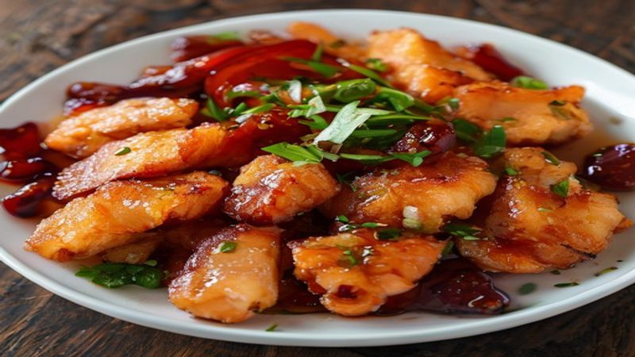

# 바삭한 탕수육 레시피
> 소스를 끼얹어도 무너지지 않는 황금 튀김옷의 비밀

---

## 핵심 비법 3가지

| 비법 | 설명 |
|------|------|
| 🌾 전분 황금 비율 | 감자전분 : 옥수수전분 : 박력분 = 3 : 1 : 1 |
| ❄️ 얼음물 반죽 | 차가운 반죽이 튀겨질 때 수분을 폭발적으로 증발시킴 |
| 🔥 2번 튀기기 | 1차 저온으로 속을 익히고, 2차 고온으로 수분을 완전 제거 |

---

## 재료 (3~4인분)

### 🥩 고기 & 밑간
- 돼지고기 안심 또는 등심 **400g**
- 청주 **2큰술**
- 생강즙 **1작은술**
- 소금·후추 **약간**

### 🌾 튀김옷
- 감자전분 **6큰술**
- 옥수수전분 **2큰술**
- 박력분 **2큰술**
- 베이킹파우더 **1/2작은술**
- 얼음물 **80~90ml**
- 달걀 흰자 **1개**

### 🍅 소스
- 물 **200ml**
- 설탕 **4큰술**
- 식초 **3큰술**
- 간장 **1큰술**
- 케첩 **1큰술**
- 물전분 (감자전분 2큰술 + 물 3큰술)

### 🥕 소스용 채소
- 파인애플, 당근, 오이, 목이버섯 **적당량**

---

## 만드는 법

### Step 1 — 고기 손질 & 밑간

돼지고기를 **한 입 크기(약 1.5cm 두께)**로 썰어 줍니다.  
청주, 생강즙, 소금, 후추를 골고루 버무린 뒤 **최소 20분** 재워 둡니다.  
냉장고에서 재우면 더욱 좋습니다.

> 💡 생강즙은 잡내 제거에 효과적입니다. 생강이 없다면 청주만 써도 괜찮아요.

---

### Step 2 — 튀김옷 반죽 만들기

1. 가루류(감자전분·옥수수전분·박력분·베이킹파우더)를 먼저 고루 섞습니다.
2. **얼음물**과 달걀 흰자를 넣고 **살살 5~6번만** 젓습니다.
3. 덩어리가 조금 남아도 괜찮습니다.

> ⚠️ **과하게 섞으면 안 됩니다!**  
> 섞을수록 글루텐이 생겨 튀김옷이 질겨지고 눅눅해지는 원인이 됩니다.

---

### Step 3 — 1차 튀기기 (160°C · 3분)

- 기름을 **160°C**로 예열합니다.
- 반죽을 입힌 고기를 하나씩 넣고 **약 3분** 튀깁니다.
- 건진 후 채반에 올려 **2분간 휴지**합니다.

> 💡 1차 튀기기의 목적은 **속을 익히는 것**입니다.  
> 겉색이 연해도 괜찮습니다. 색은 2차에서 냅니다.

---

### Step 4 — 2차 튀기기 (180°C · 30~40초)

- 기름 온도를 **180°C**로 높입니다.
- 1차 튀긴 고기를 다시 넣고 **30~40초**만 튀깁니다.
- 겉면이 **황금빛 갈색**으로 변하면 즉시 건져냅니다.

> 🔥 **이 단계가 바삭함의 핵심입니다.**  
> 30초를 넘기면 타기 시작하니 꼭 곁에서 지켜보세요!

---

### Step 5 — 소스 만들기

1. 팬에 물·설탕·식초·간장·케첩을 넣고 **중불로 끓입니다.**
2. 끓기 시작하면 **단단한 채소(당근, 목이버섯)부터** 넣고 볶습니다.
3. **무른 채소(오이, 파인애플)는 마지막에** 넣어 식감을 살립니다.
4. **물전분**을 조금씩 부어 가며 걸쭉하게 농도를 맞춥니다.

> 💡 소스가 너무 묽으면 튀김옷이 빨리 눅눅해집니다. 적당히 진하게 만드세요.

---

## 어떻게 드실 건가요?

| 방식 | 특징 | 추천 상황 |
|------|------|-----------|
| 🍯 **부먹** | 소스를 고기 위에 붓기 | 바로 먹을 때 |
| 🥢 **찍먹** | 소스를 따로 덜어 찍기 | 바삭함을 끝까지 유지하고 싶을 때 |
| 🔥 **볶아먹기** | 센 불에서 10초 이내 빠르게 버무리기 | 소스와 잘 어우러지면서 바삭함도 살리고 싶을 때 |

---

## 바삭함을 오래 유지하는 5가지 비법

1. **전분 비율을 높이세요**  
   박력분 비중을 줄이고 감자전분·옥수수전분을 늘릴수록 더 바삭합니다.

2. **반드시 얼음물을 사용하세요**  
   차가운 반죽이 기름에 들어갔을 때 수분이 폭발적으로 증발하면서 바삭한 식감을 만들어냅니다.

3. **꼭 2번 튀기세요**  
   1차(속 익히기) → 2차(수분 제거) 과정을 거치면 소스를 끼얹어도 한참 동안 바삭함이 유지됩니다.

4. **소스는 진하게 만드세요**  
   묽은 소스가 오히려 더 빨리 눅눅하게 만듭니다. 물전분을 아끼지 마세요.

5. **볶을 때는 센 불, 10초 승부**  
   소스가 튀김옷에 스며들기 전에 빠르게 버무려야 바삭함을 지킬 수 있습니다.

---

*맛있게 드세요!*
