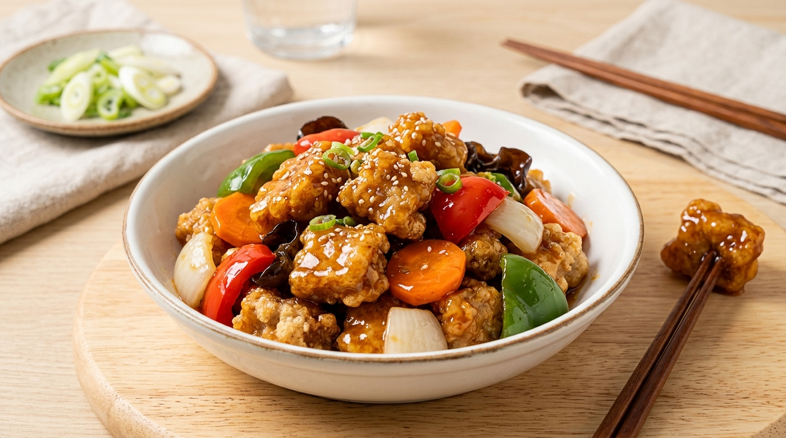

# 탕수육 레시피

## 재료 (4인분)

### 돼지고기 튀김
- 돼지고기 (등심 또는 안심) 400g
- 전분가루 1컵
- 달걀 1개
- 소금 1/2 작은술
- 후추 약간
- 식용유 (튀김용)

### 튀김 밑간
- 간장 1 큰술
- 청주 1 큰술
- 생강즙 1 작은술
- 소금 약간
- 후추 약간

### 탕수 소스
- 물 1컵
- 설탕 4 큰술
- 식초 3 큰술
- 간장 1 큰술
- 케첩 2 큰술
- 전분가루 2 큰술 (물 3 큰술에 풀어서)

### 채소
- 양파 1/2개
- 당근 1/3개
- 청피망 1/2개
- 홍피망 1/2개
- 오이 1/3개 (선택)
- 목이버섯 30g (선택)

---

## 만드는 법

### 1단계 — 고기 준비 (15분)
1. 돼지고기를 한 입 크기(3~4cm)로 썰어준다.
2. 밑간 재료(간장, 청주, 생강즙, 소금, 후추)를 넣고 **15분** 재워둔다.

### 2단계 — 튀김옷 입히기
1. 달걀을 풀어 고기에 넣고 잘 섞는다.
2. 전분가루를 넣어 고루 버무려 튀김옷을 입힌다.

### 3단계 — 튀기기
1. 식용유를 170°C로 예열한다.
2. 고기를 넣고 **3~4분** 튀긴 뒤 건져낸다.
3. 기름을 **180°C**로 높인 뒤 다시 **1~2분** 튀겨 바삭하게 완성한다 (이중 튀김).

> **Tip:** 이중 튀김을 하면 더 바삭하고 오래 바삭함이 유지됩니다.

### 4단계 — 채소 준비
1. 양파, 당근, 피망은 큼직하게 깍뚝썰기 한다.
2. 목이버섯은 물에 불려 먹기 좋게 뜯어둔다.

### 5단계 — 탕수 소스 만들기
1. 냄비에 물, 설탕, 식초, 간장, 케첩을 넣고 중불에서 끓인다.
2. 끓어오르면 채소를 넣고 1~2분 볶듯이 익힌다.
3. 물에 푼 전분물을 조금씩 부으면서 저어 원하는 농도로 맞춘다.

### 6단계 — 완성
- **부먹**: 소스를 튀긴 고기 위에 바로 부어 낸다.
- **찍먹**: 소스를 따로 그릇에 담아 찍어 먹는다.

---

## 조리 팁

| 팁 | 설명 |
|---|---|
| 기름 온도 | 처음엔 170°C, 두 번째엔 180°C로 올려야 바삭해짐 |
| 전분 농도 | 소스가 너무 묽으면 전분물을 더 추가 |
| 고기 두께 | 너무 두껍지 않게 썰어야 속까지 잘 익음 |
| 식초 | 기호에 따라 가감하여 새콤달콤 조절 |

---

## 보관 방법

- 튀김과 소스는 **따로** 보관한다.
- 냉장 보관 시 **2일** 이내 섭취 권장.
- 튀김 재가열 시 에어프라이어 사용하면 바삭함 유지 가능.
